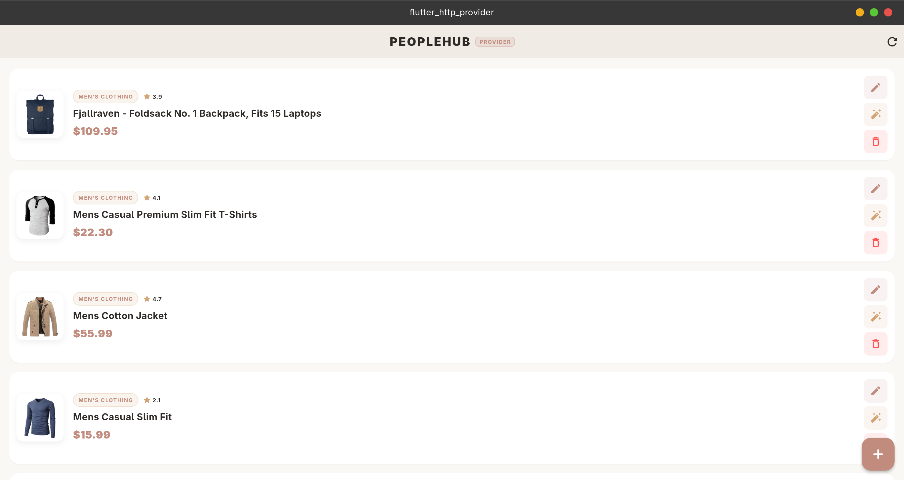
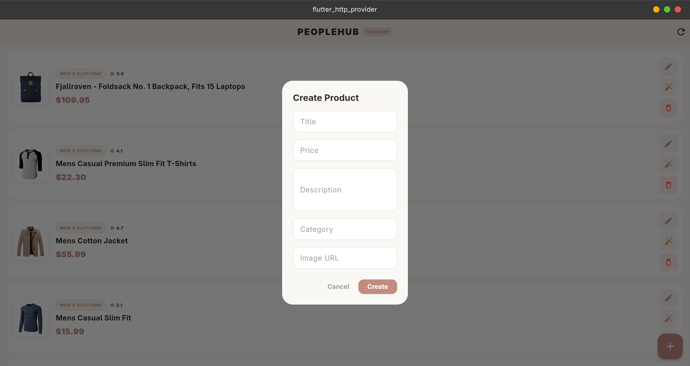
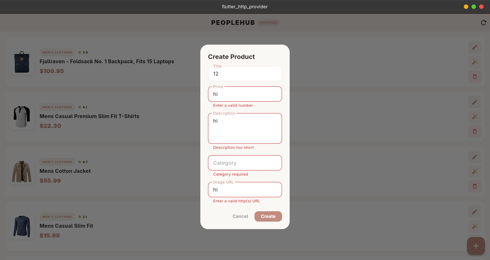
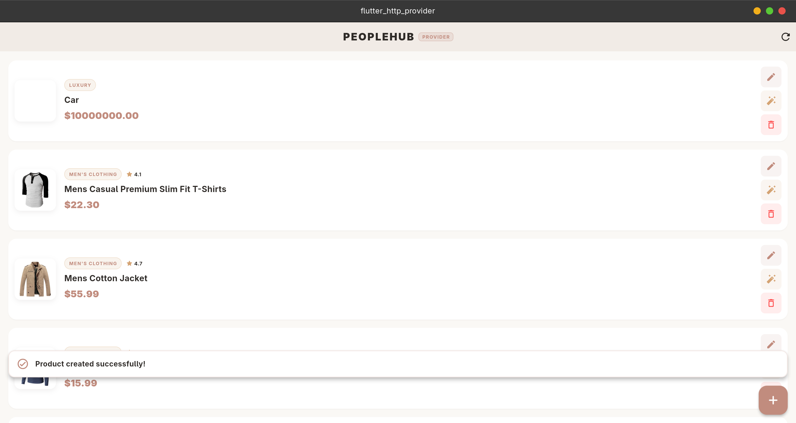
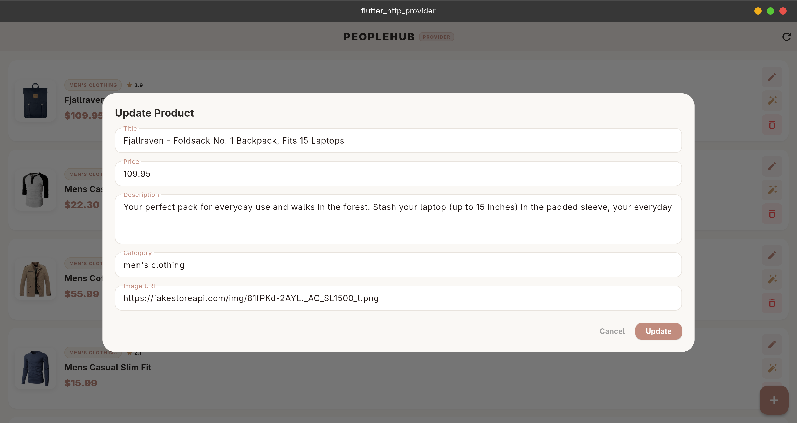
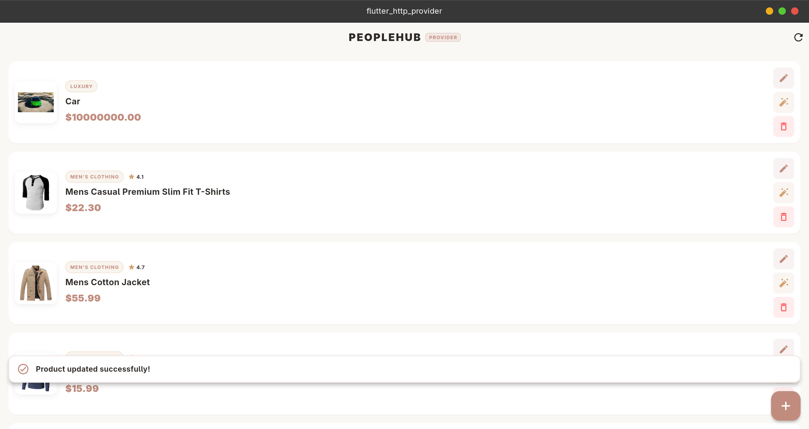
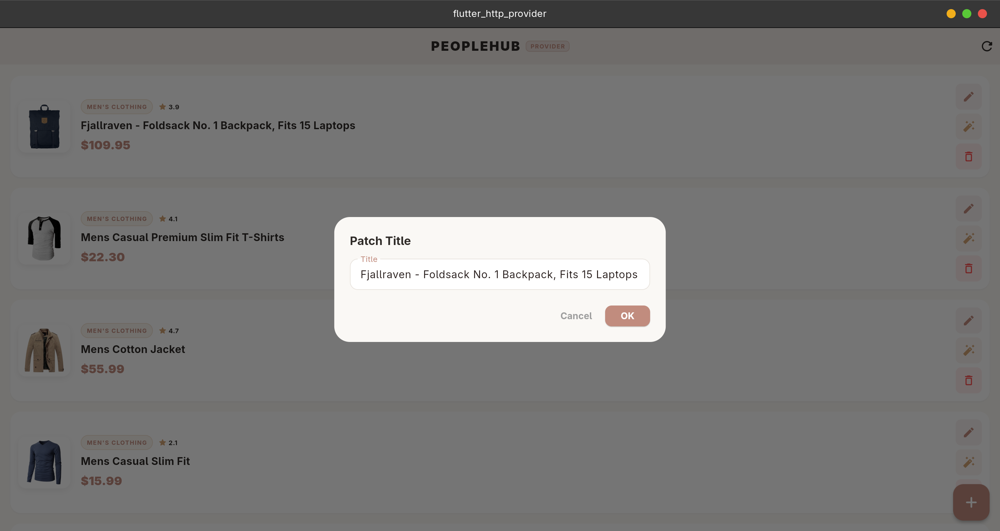
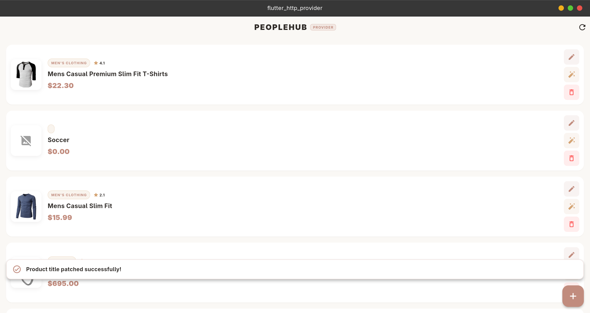
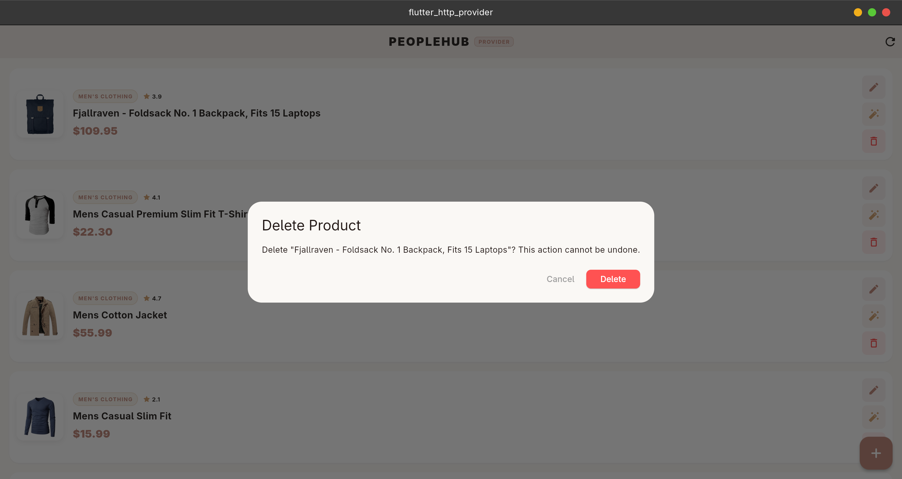
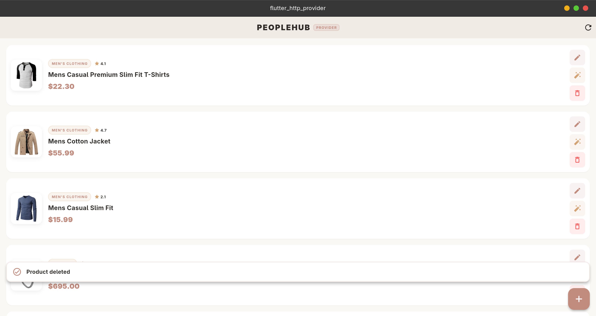

# Product Management App - Provider + HTTP

| Name | ID | Section |
| :--- | :--- | :--- |
| Abraham Nigatu Kebede | UGR/7532/16 | 2 |

A Flutter application that performs full CRUD operations on product data using the **FakeStore API**. Built with **Provider** state management and the **http** package for networking.

## API Information

**Base URL:** `https://fakestoreapi.com`

**Endpoints:**
- `GET /products` - List all products
- `GET /products/{id}` - Get single product details
- `POST /products` - Create a new product
- `PUT /products/{id}` - Update a product
- `DELETE /products/{id}` - Delete a product
- `GET /products/categories` - Get all categories
- `GET /products/category/{category}` - Get products by category

## Screenshots

### Home Screen

| Home Page |
| :---: |
|  |
| Main feed displaying the product list, category filtering, and loading state. |

### Create Product (POST)

| Create UI | Input Validation | Success Response |
| :---: | :---: | :---: |
|  |  |  |
| Entry form for new products. | Form-field validation messages. | Success prompt after POST request execution. |

### Update Product (PUT / PATCH)

| PUT Request UI | PUT Success | PATCH Request UI | PATCH Success |
| :---: | :---: | :---: | :---: |
|  |  |  |  |
| Pre-filled form for complete resource updates. | Success dialog for PUT request. | Form to edit selected fields (partial update). | Success dialog for PATCH request. |

### Delete Product (DELETE)

| Delete Confirmation | Delete Success |
| :---: | :---: |
|  |  |
| Confirmation prompt before deletion. | Success notification confirming simulated deletion. |

